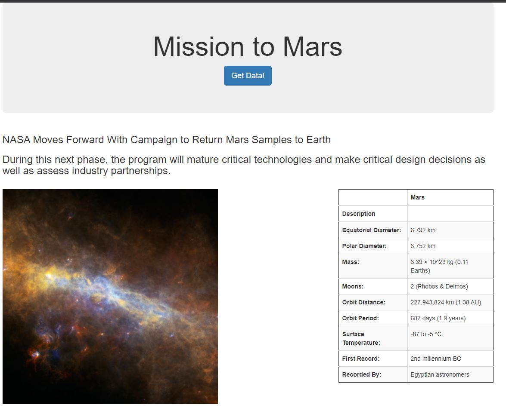
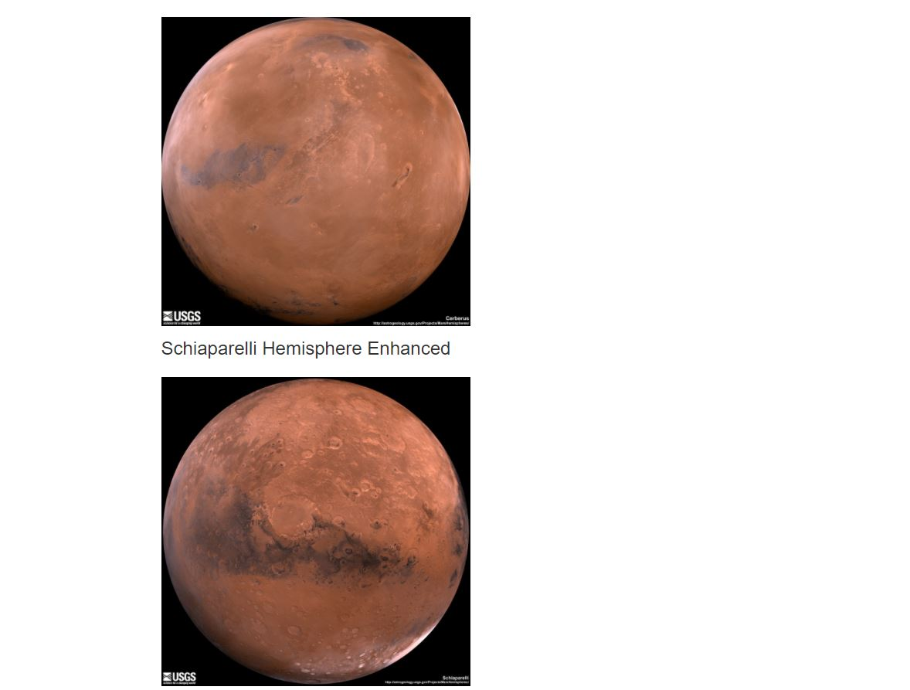
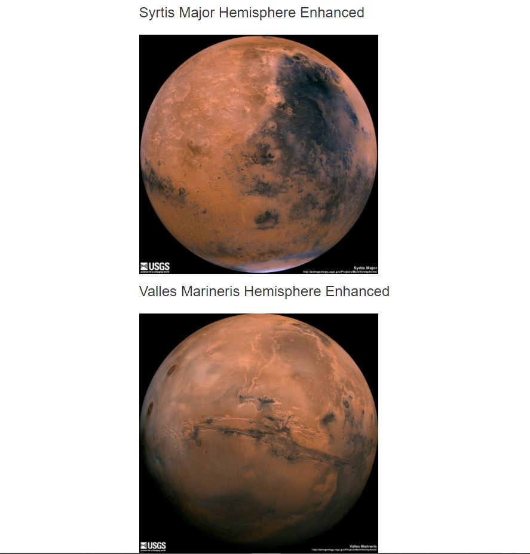

# Web-Scraping-Challenge

This assignment asked that we scrape information from the Nasa site regarding Mars and then feed into a Mongo Database to finally render it into an HTML file of our own. In combining so many different types of work together the assignment proved to be very challenging.

In order to run this assignment you need to use:

- Jupyter Notebook
- pandas
- flask
- flask-PyMongo
- splinter
- beautuiful soup
- you need to make sure you download chromedriver.eve

# Process

In order to accomplish this assignemnt, I set up the documents ahead of time and then I work through the assignment line by doing each portion of the assignment in smaller chunks.

1. I first clicked on the site link referenced in the assignment and inspected the HTML to find the data element we were asked to look for. Then I a ran beautiful soup to parse out the information I needed.
1. I did the above for all of the images asked for.
1. Then I took found the facts table and brought that into the Jupyter Notebook
1. From there I pulled the Jupyter Notebook into the .py file using the nbconvert call in gitbash. This created some unneccasary lines so I cleaned it up before I fed the code into the scrape_mars.py document.
1. I followed the templates of the Costa Rica weather activity in class to work on the flas and Mono Database.
1. From there I fed the information into html and worked on making sure the code was correct and the website was working. At this point there was a challenge in that the MongoDB return was different than what I had in my code. It took a bit of research to figure this out.
1. After I got the site to work correctly I worked on making the site look a little better.

The final html looked like:

Reflections

### Submitted by:
### Jenny Kaylor
### 12/20/2020

